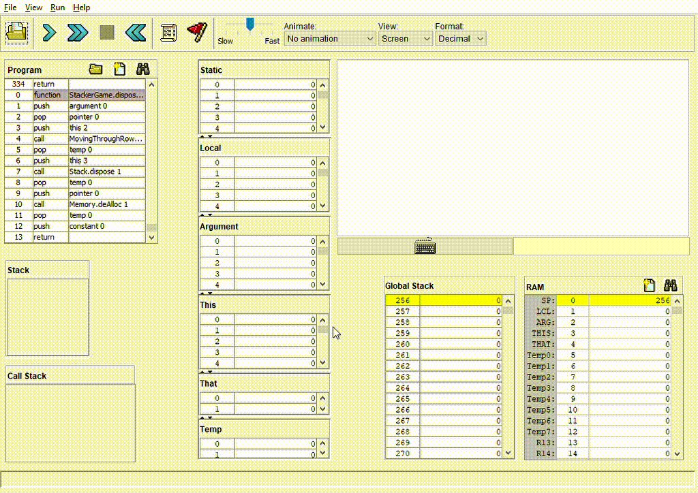

# Stacker Game
Stacker is an arcade game where the goal is to build a stack of blocks as high as possible.

At each level, a row of blocks moves sideways and the user has to lock the blocks in place (using the SPACE key) and timing it so that it aligns with the previous level. Blocks that don't align are lost and if no blocks aligned at all, the player loses.

As the levels increase, the blocks move faster making timing even more critical.
## Simulation of the game

</a>
